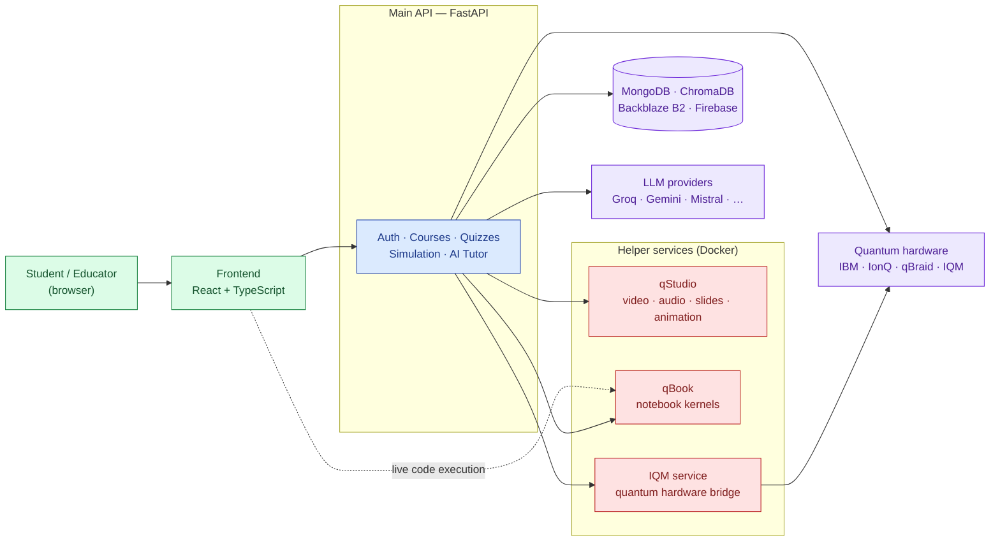
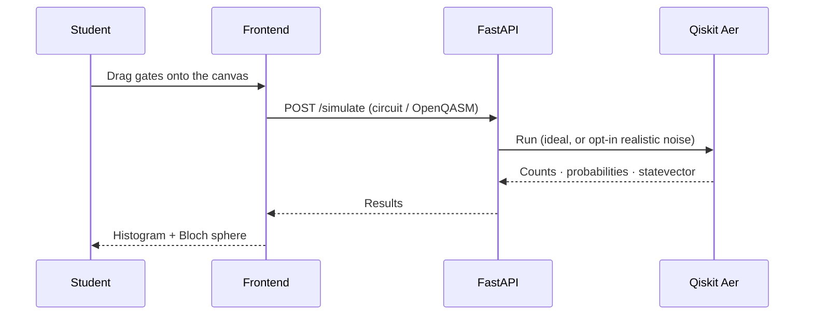
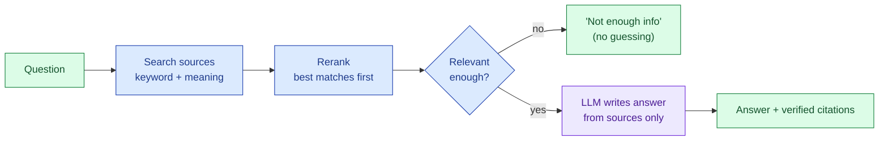
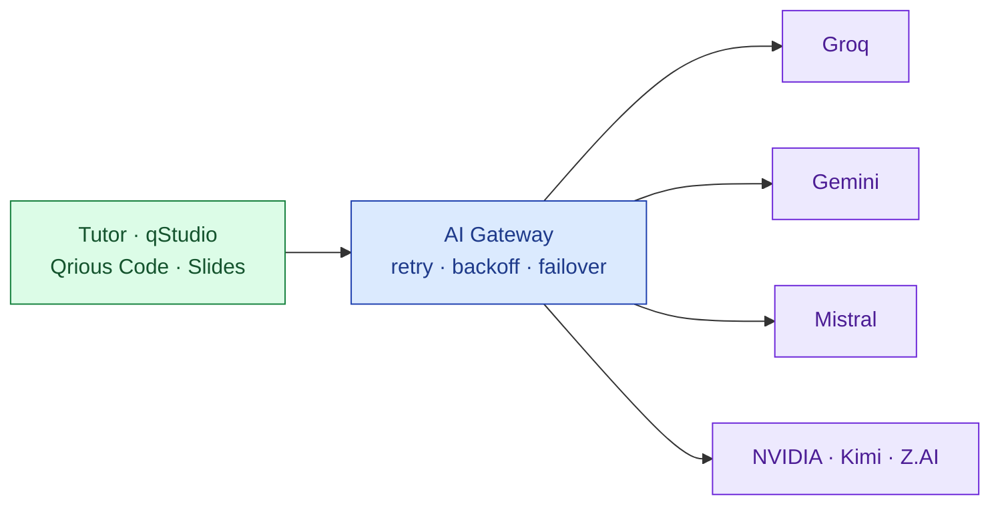
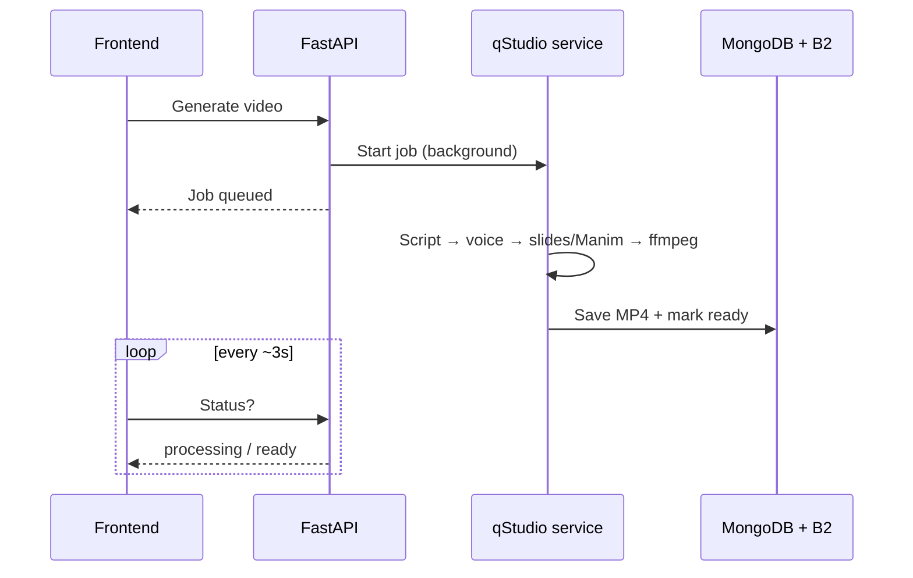
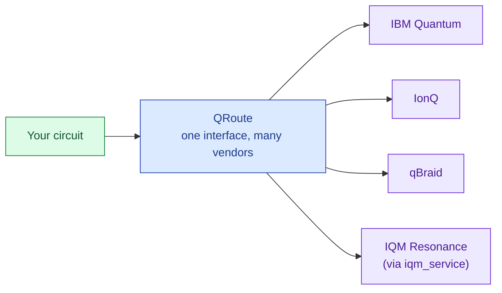
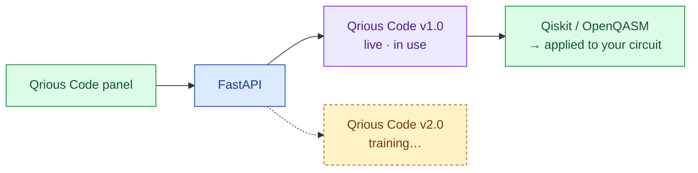

# QRIOUS: Quantum-Ready Intelligent Online Upskilling & Simulation

[](https://react.dev)
[](https://www.typescriptlang.org)
[](https://fastapi.tiangolo.com)
[](https://www.python.org)
[](https://www.ibm.com/quantum/qiskit)
[](https://www.mongodb.com/atlas)
[](https://www.docker.com)
[](https://firebase.google.com)
[](https://huggingface.co/sarvan-2187/qrious-code-1.0)

**Qrious is one web platform for learning quantum computing end to end.** Learn a concept, build the circuit, run it on a simulator or real quantum hardware, ask an AI tutor when stuck, and track progress with quizzes, badges and streaks. Nothing to install: it all runs in the browser.

 [Live Prototype](https://prototype.qriouslabs.in)


---

## Contents

- [What's inside](#whats-inside)
- [Architecture at a glance](#architecture-at-a-glance)
- [How the key pieces work](#how-the-key-pieces-work)
- [Qrious Code (AI coding assistant)](#qrious-code-ai-coding-assistant)
- [Tech stack](#tech-stack)
- [Repository layout](#repository-layout)
- [Run it locally](#run-it-locally)

---

## What's inside

| Module | What it does |
|---|---|
| **Learn** | Courses, roadmaps, video + PDF lessons, pre/post quizzes, badges and streaks |
| **Gates Playground** | Drag-and-drop circuit builder with a live Bloch sphere (Qiskit + Aer, OpenQASM import/export) |
| **AI Tutor** | Doubt-solving chat grounded in verified quantum material (RAG), so it doesn't make things up |
| **Qrious Code** | AI coding assistant that writes and explains Qiskit / OpenQASM and can apply code straight into your circuit |
| **qStudio** | Turn your notes/PDFs into mind maps, flashcards, study guides, podcasts, slides, narrated videos and Manim animations, and ask questions with cited answers |
| **qBook** | Jupyter-style notebook in the browser: run real Python/Qiskit cell by cell |
| **QRoute** | Build a circuit once and send it to real quantum hardware: IBM, IonQ, qBraid, IQM |
| **Learning Path Optimizer** | Uses QAOA (a quantum algorithm) to pick what you should study next |
| **Qplanner & Q-Rating** | Study planner and skill rating, with analytics in your profile |

---

## Architecture at a glance


Qrious is built from **one frontend, one main API, and a few small helper services**. The frontend never runs heavy logic itself: simulation, AI and rendering all happen on the backend.


*green = user-facing · blue = main API · red = Docker helper service · purple = external*

**Why split it up?** Each helper service needs heavy or conflicting dependencies (Chromium + ffmpeg + Manim for video, live Jupyter kernels for notebooks, a separate Qiskit version for IQM). Keeping them in their own containers keeps the main API light and stable.

---

## How the key pieces work

### 1. Simulating a circuit



### 2. AI that doesn't make things up (RAG)

Every answer from the AI Tutor and qStudio Q&A comes from **retrieved course material**, not the model's memory, and every citation is checked against what was actually retrieved.



### 3. One gateway for every AI call

No feature depends on a single AI vendor. If one provider is rate-limited or down, the gateway moves to the next one automatically.



### 4. Long jobs (video / animation rendering)

Rendering takes minutes, so it runs in the background. The API starts the job and replies right away, and the frontend checks the status.



### 5. Running on real quantum hardware (QRoute)



### 6. Picking what to study next (QAOA)

A classical filter first narrows ~93 roadmap topics down to at most 12 weak, unlocked ones. A small QAOA circuit then picks the best set that fits your study time. If anything fails, a classical greedy method takes over, so you always get an answer.

---

## Qrious Code (AI coding assistant)

Qrious Code is the cat-shaped launcher in the bottom-right of every page. Ask a quantum question, or have it write and explain Qiskit / OpenQASM code, then apply that code straight into the circuit you're working on.

| Version | Status | Where to get it |
|---|---|---|
| **Qrious Code v1.0** | Live, already in use | Weights hosted separately, not in this repo (see [`.gitignore`](./.gitignore)) · [Hugging Face](https://huggingface.co/sarvan-2187/qrious-code-1.0) |
| **Qrious Code v2.0** | Training in progress | Coming soon |



---

## Tech stack

| Layer | Tools |
|---|---|
| **Frontend** | React 19, TypeScript, Vite, Tailwind CSS, Shadcn UI, Magic UI, React Three Fiber |
| **Backend** | FastAPI (Python, async) |
| **Quantum** | Qiskit, Qiskit Aer, OpenQASM, QAOA; IBM / IonQ / qBraid / IQM hardware |
| **AI** | LangChain, multi-provider AI gateway (Groq, Gemini, Mistral, NVIDIA, Kimi, Z.AI), Qrious Code model |
| **RAG** | ChromaDB, BAAI/bge-small-en-v1.5 embeddings, BM25, cross-encoder reranker |
| **Media** | Manim, edge-tts, Playwright, ffmpeg |
| **Data & Auth** | MongoDB Atlas, Firebase Auth, Backblaze B2 (presigned URLs) |
| **Infra** | Docker / docker compose |

---

## Repository layout

```
├── frontend/           React app (all UI)
├── backend/            Main FastAPI API: auth, courses, simulation, AI tutor, RAG, QRoute
├── qstudio_service/    Docker: video / audio / slides / Manim rendering
├── notebook_service/   Docker: qBook Jupyter kernels (WebSocket)
├── iqm_service/        Docker: IQM Resonance hardware bridge
├── llm_service/        Qrious Code model (weights hosted separately, git-ignored)
├── assets/             README images
└── docker-compose.yml  Runs all three Docker services together
```

---

## Run it locally

**You need:** Node.js, Python 3.9+, a MongoDB instance, Firebase credentials. Docker is only needed for the optional services.

```bash
# 1. Frontend
cd frontend
npm install --legacy-peer-deps
npm run dev

# 2. Backend (new terminal)
cd backend
python -m venv venv
.\venv\Scripts\Activate        # Windows  (macOS/Linux: source venv/bin/activate)
pip install -r requirements.txt
uvicorn main:app --reload

# 3. Optional: qStudio + qBook + IQM services (from repo root)
#    first copy each service's .env.example → .env and fill it in
docker compose up --build -d
```

| Service | Port | Needed for |
|---|---|---|
| `qstudio_service` | 8080 | Video / audio / slides / animation |
| `notebook_service` | 8081 | qBook notebooks |
| `iqm_service` | 8082 | IQM hardware in QRoute |

Each service has its own `.env.example`. Service-specific guides: [`qstudio_service/DEPLOYMENT.md`](./qstudio_service/DEPLOYMENT.md) · [`iqm_service/DEPLOYMENT.md`](./iqm_service/DEPLOYMENT.md)
